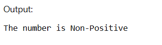
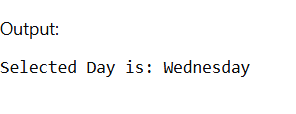
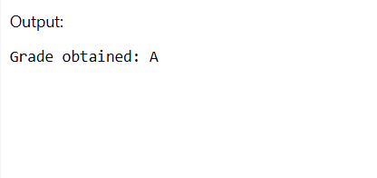
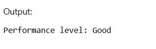

## Aim of the Practical
To understand the basic structure of a PL/SQL program by creating and executing a simple PL/SQL block that includes declaration and execution sections, and to display output using built-in procedures.

## Tool Used

### Database Management System
- Oracle Database

### Database Administration Tool
- SQL*Plus / Oracle SQL Developer

## Objective
- To implement control structures in PL/SQL.
- To understand decision-making statements such as:
  - IF–ELSE  
  - IF–ELSIF–ELSE  
  - ELSIF Ladder  
  - CASE Statements  

## Practical / Experimental Steps

1. Open SQL*Plus or Oracle SQL Developer and connect to the database.
2. Enable output using `SET SERVEROUTPUT ON;`.
3. Write and execute a PL/SQL program using IF–ELSE to check whether a number is positive or non-positive.
4. Write and run a PL/SQL program using IF–ELSIF–ELSE to display student grade based on marks.
5. Write and execute a PL/SQL program using an ELSIF ladder to determine performance status.
6. Write and run a PL/SQL program using CASE statement to display day name from day number.
7. Modify input values and re-execute programs to test different conditions.
8. Observe and record the outputs for each conditional control statement program.

## I / O Analysis

### IF–ELSE Statement
```sql
DECLARE
    value_num NUMBER := -5;
BEGIN
    IF value_num <= 0 THEN
        DBMS_OUTPUT.PUT_LINE('Number is zero or negative');
    ELSE
        DBMS_OUTPUT.PUT_LINE('Number is positive');
    END IF;
END;
/
```


---

### IF–ELSIF–ELSE Statement
```sql
DECLARE
    score NUMBER := 85;
BEGIN
    IF score >= 90 THEN
        DBMS_OUTPUT.PUT_LINE('Grade obtained: A+');
    ELSIF score >= 80 THEN
        DBMS_OUTPUT.PUT_LINE('Grade obtained: A');
    ELSIF score >= 70 THEN
        DBMS_OUTPUT.PUT_LINE('Grade obtained: B');
    ELSIF score >= 60 THEN
        DBMS_OUTPUT.PUT_LINE('Grade obtained: C');
    ELSE
        DBMS_OUTPUT.PUT_LINE('Result: Fail');
    END IF;
END;
/
```


---

### ELSIF Ladder
```sql
DECLARE
    marks NUMBER := 72;
BEGIN
    IF marks >= 90 THEN
        DBMS_OUTPUT.PUT_LINE('Performance: Excellent');
    ELSIF marks >= 75 THEN
        DBMS_OUTPUT.PUT_LINE('Performance: Very Good');
    ELSIF marks >= 60 THEN
        DBMS_OUTPUT.PUT_LINE('Performance: Good');
    ELSIF marks >= 40 THEN
        DBMS_OUTPUT.PUT_LINE('Performance: Average');
    ELSE
        DBMS_OUTPUT.PUT_LINE('Performance: Poor');
    END IF;
END;
/
```


---

### CASE Statement
```sql
DECLARE
    day_no NUMBER := 4;
    day_label VARCHAR2(20);
BEGIN
    CASE day_no
        WHEN 1 THEN day_label := 'Sunday';
        WHEN 2 THEN day_label := 'Monday';
        WHEN 3 THEN day_label := 'Tuesday';
        WHEN 4 THEN day_label := 'Wednesday';
        WHEN 5 THEN day_label := 'Thursday';
        WHEN 6 THEN day_label := 'Friday';
        WHEN 7 THEN day_label := 'Saturday';
        ELSE
            day_label := 'Day not valid';
    END CASE;

    DBMS_OUTPUT.PUT_LINE('Selected Day is: ' || day_label);
END;
/
```


---

## Learning Outcomes
- Understood the basic structure of a PL/SQL block, including the DECLARE and BEGIN…END sections.
- Learned how to declare and initialize variables for storing data values.
- Gained knowledge of using `DBMS_OUTPUT.PUT_LINE` to display results during execution.
- Practiced performing operations and implementing logic inside PL/SQL blocks.
- Developed understanding of decision-making using IF–ELSIF–ELSE conditional statements.
- Acquired practical insight into how PL/SQL can be used for database-related computations and control flow.